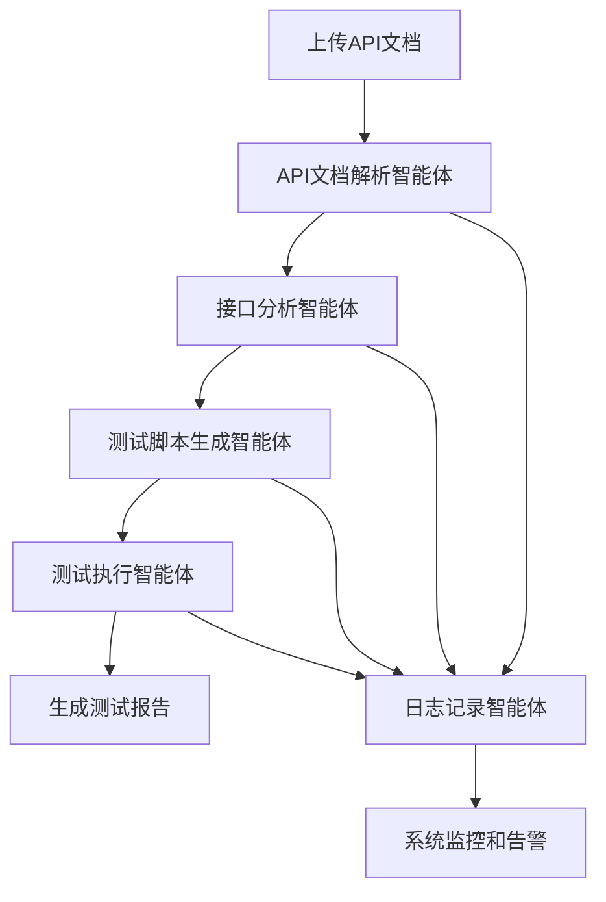

# 接口自动化智能体系统

基于AutoGen框架实现的完整接口自动化智能体系统，支持API文档解析、依赖分析、测试脚本生成和自动化执行。

## 🎯 系统概述

本系统实现了一套完整的接口自动化智能体架构，包含以下核心功能：

1. **API文档解析** - 支持Swagger、OpenAPI、Postman等多种格式
2. **接口全面分析** - 深度分析API的各个维度（参数、响应、业务逻辑、安全性、性能、测试策略等）
3. **测试脚本生成** - 基于全面分析结果生成高质量的pytest+allure测试脚本
4. **自动化测试执行** - 支持并行执行和多种报告格式
5. **智能体日志记录** - 完整的执行日志和监控

## 🏗️ 系统架构

### 智能体组件

```
┌─────────────────────────────────────────────────────────────┐
│                    接口自动化智能体系统                        │
├─────────────────────────────────────────────────────────────┤
│  📄 API文档解析智能体 (ApiDocParserAgent)                    │
│  ├─ 支持多种文档格式 (Swagger/OpenAPI/Postman)              │
│  ├─ 智能格式检测                                            │
│  └─ 端点信息提取                                            │
├─────────────────────────────────────────────────────────────┤
│  🔍 接口分析智能体 (ApiAnalyzerAgent)                        │
│  ├─ 参数深度分析（类型、验证、边界值、安全级别）              │
│  ├─ 响应数据分析（结构、字段、状态码、错误场景）              │
│  ├─ 业务逻辑分析（CRUD操作、工作流、副作用、复杂度）          │
│  ├─ 安全性分析（认证、权限、敏感数据、风险评估）              │
│  ├─ 性能分析（复杂度、响应时间、资源消耗、缓存）              │
│  ├─ 依赖关系分析（数据依赖、执行顺序、循环检测）              │
│  └─ 测试策略分析（测试类型、优先级、覆盖度、自动化）          │
├─────────────────────────────────────────────────────────────┤
│  🔧 测试脚本生成智能体 (TestScriptGeneratorAgent)            │
│  ├─ pytest测试脚本生成                                      │
│  ├─ allure报告集成                                          │
│  ├─ 数据驱动测试支持                                        │
│  └─ 多种测试类型 (功能/性能/安全)                            │
├─────────────────────────────────────────────────────────────┤
│  🚀 测试执行智能体 (TestExecutorAgent)                       │
│  ├─ 并行/串行执行                                           │
│  ├─ 实时结果收集                                            │
│  ├─ 多种报告格式 (allure/HTML/JSON)                         │
│  └─ 失败重试机制                                            │
├─────────────────────────────────────────────────────────────┤
│  📝 日志记录智能体 (LogRecorderAgent)                        │
│  ├─ 智能体日志收集                                          │
│  ├─ 会话状态跟踪                                            │
│  ├─ 系统健康监控                                            │
│  └─ 日志导出功能                                            │
└─────────────────────────────────────────────────────────────┘
```

### 工作流程



## 🚀 快速开始

### 1. 环境准备

```bash
# 安装依赖
pip install -r requirements.txt

# 确保安装了pytest和allure
pip install pytest allure-pytest

# 安装allure命令行工具 (可选)
# 下载并安装 Allure CLI
```

### 2. 基本使用

#### 通过API接口使用

```python
import requests

# 1. 上传API文档
with open('api_doc.json', 'rb') as f:
    response = requests.post(
        'http://localhost:8000/api/v1/api-automation/upload-document',
        files={'file': f},
        data={
            'doc_format': 'openapi',
            'config': '{"include_error_cases": true}'
        }
    )

session_id = response.json()['session_id']

# 2. 查询处理状态
status_response = requests.get(
    f'http://localhost:8000/api/v1/api-automation/session/{session_id}/status'
)

# 3. 执行测试 (如果脚本已生成)
test_response = requests.post(
    'http://localhost:8000/api/v1/api-automation/execute-tests',
    json={
        'session_id': session_id,
        'script_files': ['./generated_tests/test_api.py'],
        'config': {
            'framework': 'pytest',
            'parallel': False,
            'report_formats': ['allure', 'html']
        }
    }
)
```

#### 通过编程接口使用

```python
import asyncio
from app.services.api_automation import ApiAutomationOrchestrator

async def main():
    # 创建编排器
    orchestrator = ApiAutomationOrchestrator()
    await orchestrator.initialize()
    
    try:
        # 处理API文档
        result = await orchestrator.process_api_document(
            session_id="demo_session",
            file_path="./api_doc.json",
            file_name="api_doc.json",
            doc_format="openapi"
        )
        
        print(f"处理结果: {result}")
        
    finally:
        await orchestrator.cleanup()

asyncio.run(main())
```

### 3. 运行示例

```bash
# 运行完整示例
python backend/app/examples/api_automation_example.py
```

## 📋 API接口文档

### 核心接口

| 接口 | 方法 | 描述 |
|------|------|------|
| `/upload-document` | POST | 上传API文档 |
| `/session/{session_id}/status` | GET | 获取会话状态 |
| `/execute-tests` | POST | 执行测试 |
| `/sessions` | GET | 获取所有会话 |
| `/metrics` | GET | 获取系统指标 |
| `/session/{session_id}/reports` | GET | 获取测试报告 |
| `/download/report/{file_name}` | GET | 下载报告文件 |

### 请求示例

#### 上传API文档

```bash
curl -X POST "http://localhost:8000/api/v1/api-automation/upload-document" \
  -H "Content-Type: multipart/form-data" \
  -F "file=@api_doc.json" \
  -F "doc_format=openapi" \
  -F "config={\"include_error_cases\": true}"
```

#### 查询会话状态

```bash
curl -X GET "http://localhost:8000/api/v1/api-automation/session/{session_id}/status"
```

## 🔧 配置说明

### API文档解析配置

```json
{
  "parse_config": {
    "supported_formats": ["swagger", "openapi", "postman"],
    "max_file_size": 52428800,
    "timeout": 300
  }
}
```

### 测试生成配置

```json
{
  "test_config": {
    "framework": "pytest",
    "include_allure": true,
    "include_error_cases": true,
    "include_boundary_cases": true,
    "include_performance_cases": false,
    "respect_dependencies": true
  }
}
```

### 测试执行配置

```json
{
  "execution_config": {
    "framework": "pytest",
    "parallel": false,
    "max_workers": 1,
    "timeout": 300,
    "retry_count": 3,
    "report_formats": ["allure", "html", "json"],
    "log_level": "INFO"
  }
}
```

## 📊 生成的测试脚本示例

系统会生成如下结构的pytest测试脚本：

```python
"""
自动生成的API测试脚本
"""
import pytest
import allure
import requests
from .base_api_test import BaseApiTest

@allure.feature("用户管理")
class TestUsersApi(BaseApiTest):
    
    @allure.story("获取用户列表")
    @allure.severity(allure.severity_level.CRITICAL)
    @pytest.mark.functional
    def test_get_users_success(self):
        """测试获取用户列表成功场景"""
        with allure.step("发送GET请求"):
            response = self.client.get("/users")
        
        with allure.step("验证响应"):
            assert response.status_code == 200
            assert "data" in response.json()
    
    @allure.story("创建用户")
    @allure.severity(allure.severity_level.CRITICAL)
    @pytest.mark.functional
    def test_create_user_success(self):
        """测试创建用户成功场景"""
        user_data = {
            "username": "testuser",
            "email": "test@example.com",
            "name": "Test User"
        }
        
        with allure.step("发送POST请求"):
            response = self.client.post("/users", json=user_data)
        
        with allure.step("验证响应"):
            assert response.status_code == 201
            assert response.json()["data"]["username"] == "testuser"
```

## 📈 监控和日志

### 系统指标

- 智能体健康状态
- 处理成功率
- 平均处理时间
- 错误统计
- 资源使用情况

### 日志级别

- **DEBUG**: 详细调试信息
- **INFO**: 一般信息记录
- **WARNING**: 警告信息
- **ERROR**: 错误信息
- **CRITICAL**: 严重错误

### 日志查询

```python
# 获取会话日志
logs = await log_recorder.get_session_logs(session_id)

# 获取智能体日志
agent_logs = await log_recorder.get_agent_logs("ApiDocParserAgent")

# 导出日志
export_file = await log_recorder.export_session_logs(session_id, "json")
```

## 🔍 故障排除

### 常见问题

1. **文档解析失败**
   - 检查文档格式是否正确
   - 确认文件大小不超过限制
   - 查看解析错误日志

2. **测试执行失败**
   - 检查pytest是否正确安装
   - 确认测试环境配置
   - 查看执行日志

3. **报告生成失败**
   - 检查allure是否安装
   - 确认报告目录权限
   - 查看生成日志

### 日志查看

```bash
# 查看系统日志
tail -f ./logs/api_automation_$(date +%Y-%m-%d).log

# 查看特定智能体日志
grep "ApiDocParserAgent" ./logs/api_automation_*.log
```

## 🛠️ 扩展开发

### 添加新的智能体

1. 继承BaseAgent类
2. 实现process_message方法
3. 注册到AgentFactory
4. 定义消息类型

```python
from app.core.agents.base import BaseAgent

class CustomAgent(BaseAgent):
    async def process_message(self, message, ctx):
        # 实现消息处理逻辑
        pass
```

### 添加新的文档格式支持

1. 在ApiDocParserAgent中添加解析器
2. 实现格式检测逻辑
3. 添加相应的测试用例

## 📝 更新日志

### v1.0.0 (2024-01-20)
- 初始版本发布
- 实现核心智能体功能
- 支持基本的API文档解析和测试生成

## 🤝 贡献指南

1. Fork项目
2. 创建功能分支
3. 提交更改
4. 创建Pull Request

## 📄 许可证

MIT License

## 📞 联系方式

如有问题或建议，请通过以下方式联系：

- 邮箱: support@example.com
- 项目地址: https://github.com/example/api-automation
